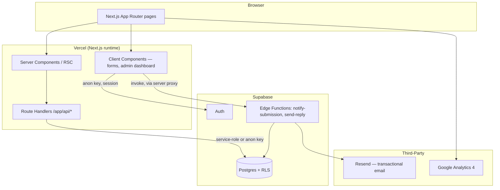

# 03 — System Architecture

## 1. High-Level Diagram

## 2. Rendering Strategy
| Route group | Strategy | Reason |
|---|---|---|
| `/`, `/about`, `/web-software`, `/it-support`, `/portfolio`, `/blog`, `/blog/[slug]`, `/capability-statement`, `/privacy-policy`, `/terms-of-service` | **Static (SSG)** with `generateMetadata` | Content is static/typed data; maximizes SEO + speed |
| `/contact`, `/quote` | Static shell + Client Component form "island" | Form needs interactivity; surrounding content is static |
| `/admin/**` | Client-rendered, gated by `middleware.ts`, `dynamic = 'force-dynamic'` | Private, session-dependent, no SEO need |
| `sitemap.xml`, `robots.txt` | Generated via Next.js Metadata file conventions (`app/sitemap.ts`, `app/robots.ts`) | Always in sync with the route table, including every blog slug |

## 3. Data Flow — Public Lead Forms
1. User submits a form (Contact, Quote, Software Service Request, Newsletter) — Client Component using `react-hook-form` + `zod`.
2. Client calls a Next.js **Route Handler** (`/app/api/...`), never Supabase directly.
3. Route Handler validates with the same shared `zod` schema, inserts into Supabase using the service-role key (server-only), then triggers an email notification via a Supabase Edge Function (server-to-server call — the Edge Function URL/key is never exposed to the browser).
4. Response returns success/error to the client; toast shown; form resets on success.

## 4. Data Flow — Admin Dashboard
1. `/admin/login` — Supabase Auth email/password sign-in.
2. `middleware.ts` checks the session on every `/admin/**` request; no session → redirect to `/admin/login`.
3. Role is re-verified server-side (via a `private.has_role()` Postgres function) before any admin data is returned — defense in depth beyond the middleware check.
4. Dashboard tabs (Contacts, Quotes, Analytics, Settings) fetch through admin Route Handlers backed by RLS-protected Supabase queries.
5. Replies re-verify the session server-side, then call the `send-reply` Edge Function.

## 5. Content Architecture
Content is **structured data, not prose pages**. The corporate profile content (services, engagement process, service commitments, company fact sheet, FAQ, partnerships, roadmap, promise, contact info) lives in typed TypeScript data modules under `src/data/` — see `07-content-data-model.md` for the full field-by-field structure. Pages import and render this data; nothing is hard-coded prose duplicated across files.

## 6. Environments
- **Local** — `.env.local`, hosted Supabase project.
- **Preview** — Vercel preview deployments per branch/PR.
- **Production** — Vercel production, custom domain, production secrets.

## 7. Key Architectural Decisions
| Decision | Rationale |
|---|---|
| Next.js App Router (not Pages Router) | Native layouts, streaming, `generateMetadata`, Server Components — best fit for SEO |
| Supabase for backend | Postgres + Auth + Edge Functions in one managed platform; RLS gives strong data-access guarantees without a bespoke API layer |
| Route Handlers as the only public entry point (proxy in front of Edge Functions) | Keeps service-role logic server-side; centralizes validation with one shared `zod` schema per form |
| shadcn/ui | Owns its generated code (not a black-box dependency), composes cleanly with Tailwind tokens |
| Structured content over prose documents | One source of truth that renders to the website *and* to generated PDF/letterhead exports |
