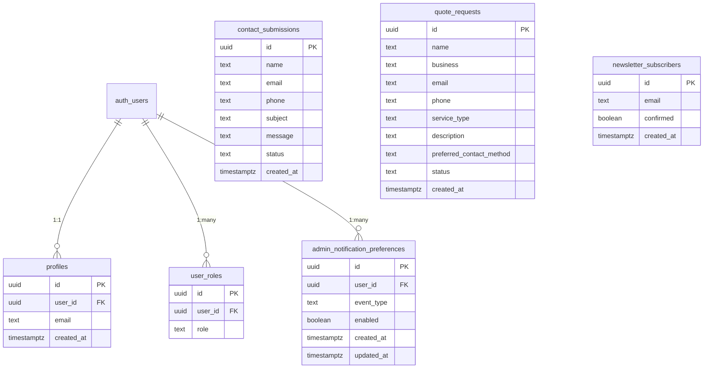

# 04 — Database Design (Supabase / Postgres)

## 1. Entity-Relationship Overview



## 2. Tables

### `contact_submissions`
`id` uuid PK · `name` text · `email` text · `phone` text (nullable) · `subject` text · `message` text · `status` text default `'new'` (`new` / `read` / `replied`) · `created_at` timestamptz default `now()`

### `quote_requests`
`id` uuid PK · `name` text · `business` text (nullable) · `email` text · `phone` text (nullable) · `service_type` text · `description` text · `preferred_contact_method` text (nullable) · `status` text default `'new'` · `created_at` timestamptz default `now()`

### `newsletter_subscribers`
`id` uuid PK · `email` text unique · `confirmed` boolean default `false` · `created_at` timestamptz default `now()`

### `user_roles`
`id` uuid PK · `user_id` uuid FK → `auth.users` (cascade) · `role` `app_role` enum · unique `(user_id, role)`

### `profiles`
`id` uuid PK · `user_id` uuid FK → `auth.users` (cascade, unique) · `email` text · `created_at` timestamptz

### `admin_notification_preferences`
`id` uuid PK · `user_id` uuid FK → `auth.users` (cascade) · `event_type` text (`new_contact` / `new_quote` / `new_newsletter_signup`) · `enabled` boolean default `true` · `created_at`, `updated_at` timestamptz · unique `(user_id, event_type)`

### Enum: `app_role`
`'admin' | 'user'`

## 3. Functions & Triggers
- **`private.has_role(_user_id uuid, _role app_role) → boolean`** — `SECURITY DEFINER`, `STABLE`, lives in the `private` schema (not `public`), so it cannot be exposed as a callable RPC via PostgREST. Every RLS policy on every table calls this function.
- **`public.handle_new_user()`** — `SECURITY DEFINER` trigger, `AFTER INSERT ON auth.users`, auto-creates the matching `profiles` row. `EXECUTE` revoked from `PUBLIC`, `anon`, `authenticated`.

## 4. Migration Plan
1. Create `contact_submissions`, `quote_requests`; enable RLS; **no public INSERT policy** — all public writes happen server-side only, from the first migration.
2. Create `app_role` enum, `user_roles`, `profiles`, `private.has_role()`, the new-user trigger, `status` columns, and full admin SELECT/UPDATE/DELETE policies.
3. Create `admin_notification_preferences` with owner-scoped admin-only CRUD policies.
4. Create `newsletter_subscribers`, RLS server-only write, admin-only SELECT.

## 5. RLS Summary
| Table | anon | authenticated (non-admin) | admin |
|---|---|---|---|
| `contact_submissions` | no access | no access | SELECT / UPDATE / DELETE |
| `quote_requests` | no access | no access | SELECT / UPDATE / DELETE |
| `newsletter_subscribers` | no access | no access | SELECT |
| `profiles` | no access | own row only | all rows |
| `user_roles` | no access | own roles only | all rows |
| `admin_notification_preferences` | no access | no access | own rows only |

All public writes go through server-side code holding the service-role key — never through a client-side anon INSERT policy.

## 6. Admin Provisioning
There is no public sign-up flow. To create an admin:
1. Create the user in the Supabase Auth dashboard (Authentication → Add user). The `handle_new_user` trigger auto-creates the `profiles` row.
2. Grant the role:
   ```sql
   insert into public.user_roles (user_id, role)
   values ('<auth-user-uuid>', 'admin');
   ```
3. Confirm `profiles.email` is populated (required for that admin to receive notification emails).

## 7. Storage
Not required for v1. Logo/letterhead assets are checked into the repo (`public/brand/`). If a future content-management phase needs uploaded media, add a Supabase Storage bucket with admin-only write / public read policies at that point.
